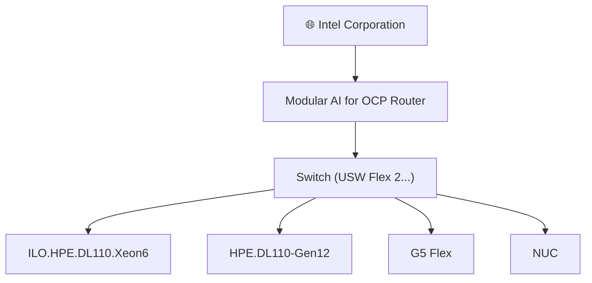
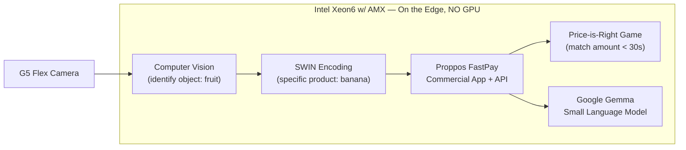

# ModularAI Developed and Integrated for targeted Xeon Edge AI customers and Open Compute Project 2026 Demonstration

## Welcome — Modular CV and GenAI on Xeon at the Edge

Welcome! This project showcases **Modular CV and GenAI on Xeon at the Edge**. Where OCP offers the hardware modularity, this demo shows **AI modularity at the Edge** — CV / GenAI / Agentic (not live).

The live demo uses an **HPE DL110** with a **40-core Xeon6 CPU w/ Intel AMX (no GPU!)**, **Proppos FastPay** for the front-end computer vision object detection, encoding, and attribute association, plus an optional **GenAI back-end**.

Incremental CV training/encoding on the Xeon is used together with generic YOLO to identify *specific* objects (e.g., "banana" instead of generic "fruit," along with price, calories, etc.) before encoding, and **Google Gemma** performs the GenAI analysis (e.g., *How many calories? How much do I need to pay? Any allergy concerns?* etc.).

In other words, this is the **Proppos commercial application**, "extended" to use the latest **Google Gemma** model-set and associated optimizations to serve responses in a few seconds, using just a few cores.

## Prepared By

- **Repository:** https://github.com/stephen-palermo/modularAI.git
- **Author:** Stephen Palermo — stephen.t.palermo@intel.com, Tech Lead Xeon Edge AI
- **Supporting repository:** https://github.com/stephen-palermo/workshop-xeon-edge-ai-gemma.git

## Getting Started

Follow these steps to showcase the technology and run the demo.

### (a) NUC

1. **Browser for LIVE AI Computer Vision:** http://192.168.0.16:8081
2. **Browser for LIVE AI API feeding the "QuickBytes Game":** file:///opt/QuickBytes-OCP.demo.html
3. **Browser for LIVE AI Small Language Model (Gemma E2B):** http://192.168.0.16:5003/

### (b) Xeon AI Server — HPE DL110 w/ Xeon6 w/ Intel AMX

1. **Desktop Terminal — START the back-end:**

   ```bash
   cd /opt/workshop-xeon-edge-ai-gemma
   ./9.proppos-backend-start.sh
   ```

## Example Output

Expected output that matches up with the **Getting Started** section.

### (a) NUC

**LIVE AI Computer Vision (http://192.168.0.16:8081)** — Fixed products captures view detecting objects in real time (e.g., Banana $1.25, Apple $1.75, Chocolate Ice Cream Cone $2.00) with confidence scores:

```
LQ S CS:[32-300-300]:00  M:[200-200-300] @30 T: 200 L: 0 H:10.0:30 R:303
Banana    $1.25   65%   0.1037
Apple     $1.75   42%   0.0347
Apple     $1.75   44%   0.0322
Chocolate ...
```

**LIVE AI API feeding the "QuickBytes Game" (file:///opt/QuickBytes-OCP.demo.html)** — Quick Bytes Challenge totaling the detected products against the spend limit:

```
Quick Bytes Challenge  <= Spend Limit < 30 seconds
WIN if within 50 cents without going over Spend Limit

TOTAL AMOUNT:  $6.75
RESET VALUE:   $8.00
COUNT DOWN:    25S

Products Included:
  Chocolate Ice Cream Cone $2.00
  Apple  $1.75
  Banana $1.25
  Apple  $1.75
```

### (b) HPE DL110

**Xeon AI Server back-end start (./9.proppos-backend-start.sh)** — Flask back-end serving the Proppos Gemma-4-E2B app:

```
 * Serving Flask app 'backend-Proppos-gemma-4-e2b'
 * Debug mode: on
WARNING: This is a development server. Do not use it in a production deployment. Use a production WSGI server instead.
 * Running on all addresses (0.0.0.0)
 * Running on http://127.0.0.1:5003
 * Running on http://192.168.0.16:5003
Press CTRL+C to quit
 * Restarting with stat
 * Debugger is active!
 * Debugger PIN: 128-410-576
```

## Technology

The entire pipeline runs on an **Intel Xeon6 CPU with Intel Advanced Matrix Extensions (Intel AMX)** — **no GPU required**. Intel AMX is a built-in matrix-multiply accelerator (tile registers + TMUL) that dramatically speeds up the dense INT8/BF16 math at the heart of modern AI, directly on the CPU.

### (1) Intel AMX for Computer Vision

- **Usage:** The YOLO-based object detection, incremental CV training, and encoding/attribute-association work are offloaded to Intel AMX tiles, accelerating the convolution and matrix operations that dominate CV inference.
- **Benefits:** High-throughput, low-latency detection of *specific* objects (e.g., "banana" instead of generic "fruit," with price and calories) in real time — all on the CPU, with no discrete accelerator, no data movement to a GPU, and consistent performance at the Edge.

### (2) Intel AMX for Small Language Models (Gemma — not an LLM)

- **Usage:** The **Google Gemma (E2B)** Small Language Model inference uses Intel AMX to accelerate the BF16/INT8 matrix multiplications in the transformer layers.
- **Benefits:** GenAI responses (e.g., *How many calories? How much do I need to pay? Any allergy concerns?*) are served in **a few seconds using just a few cores**. Because it's a right-sized *Small* Language Model — not a large LLM — Intel AMX delivers the needed throughput without a GPU, keeping the model and memory footprint compact and Edge-friendly.

### (3) Modular CV + SLM for LangChain Agentic Workflows

- **Usage:** Both the computer vision stage and the Gemma Small Language Model are composed into **LangChain-based agentic workflows**, where CV detections feed the SLM for reasoning and the agent orchestrates multi-step tasks.
- **Benefits of Intel Xeon w/ AMX:**
  - **Everything stays on the CPU** — CV and SLM share the same Intel AMX-accelerated host, with no cross-device data transfers.
  - **No GPU** — no discrete accelerator to provision, cool, or maintain.
  - **Lower power** — no GPU power envelope; efficient CPU-only operation.
  - **Lower total cost of ownership (TCO)** — simpler, modular hardware that leverages the OCP platform, reducing acquisition and operational costs at the Edge.

## Network Architecture Example

The demo runs on a compact, modular Edge network. The Intel Corporation uplink connects through the **Modular AI for OCP Router** into a **USW Flex 2 switch**, which fans out to the Xeon AI server (and its iLO management), the Gen12 node, the G5 Flex camera, and the NUC front-end.



| Node | Role |
| --- | --- |
| **Intel Corporation** | Internet / corporate uplink |
| **Modular AI for OCP Router** | Edge gateway/router for the Modular AI for OCP network |
| **Switch (USW Flex 2)** | Distribution switch connecting all Edge devices |
| **ILO.HPE.DL110.Xeon6** | Out-of-band iLO management for the Xeon6 AI server |
| **HPE.DL110-Gen12** | HPE DL110 Gen12 Xeon6 w/ Intel AMX — AI server running the CV + Gemma back-end |
| **G5 Flex** | Camera providing the live video feed for computer vision |
| **NUC** | Front-end client running the demo browsers (CV, QuickBytes game, Gemma SLM) |

## Modular Technology Showcase Flow

This demo showcases AI modularity by chaining independent stages — each running **on the Edge, entirely on Intel Xeon w/ AMX, with NO GPU**.

1. **Computer Vision + SWIN encoding (Commercial App = Proppos FastPay):** Computer vision first identifies basic objects (e.g., *fruit*), then **SWIN encoding** further identifies the *specific* product (e.g., *banana*) for a **FastPay**-type application. This is the commercial Proppos application.
2. **Commercial App API → Price-is-Right challenge:** The commercial app API transfers the computer vision output for further processing, such as a **challenge "Price-is-Right" game** — the objective is to match a random amount in **less than 30 seconds** by reading the live output of computer vision.
3. **Computer Vision → Small Language Model (Google Gemma):** The computer vision output is fed into a **Small Language Model** for further analysis. The SLM shown is the commercial **Google Gemma** model.



**All running on the Edge, all on Intel Xeon w/ AMX — NO GPU.**